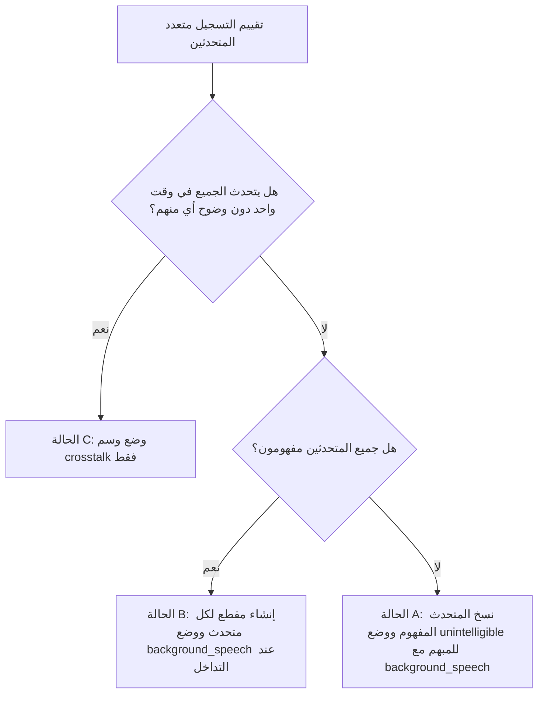

# دليل وقواعد تفريغ وترقيم التسجيلات الصوتية (MSA Audio Transcription Guidelines)

> [!IMPORTANT]
> **اللغة المستهدفة:** العربية الفصحى الحديثة (**Modern Standard Arabic - MSA**).
> 
> يجب الالتزام التام بالنسخ الحرفي والدقيق وفق القواعد والوسوم الموضحة في هذا الدليل.

---

## ⚠️ التحقق الأولي واشتراطات البدء في المهمة

قبل البدء في أي عملية تفريغ نصي أو تقسيم للمتحدثين، يجب إجراء التحقق التالي:

### هل الصوت المنطوق باللغة العربية الفصحى الحديثة (MSA)؟

* **المهمة مخصصة فقط** للنصوص المنطوقة باللغة العربية الفصحى الحديثة.
* إذا كان المتحدث **لا يستخدم العربية الفصحى الحديثة** (مثل: العاميات، أو لغة أجنبية بالكامل):
  1. **لا تقم** بنسخ الصوت.
  2. **لا تقم** بالعمل على هذه المهمة.
  3. اختر **"الصوت ليس باللغة العربية الفصحى الحديثة"** من القائمة المنسدلة.
  4. اضغط على زر **الإرسال** للانتقال إلى المهمة التالية.

> [!WARNING]
> * **التعويض المالي:** لن يتم تعويض العمل المنجز على تسويغ أو تفريغ أصوات غير فصحى حديثة.
> * **اختيار القائمة المنسدلة:** يجب عليك تحديد الخيار الصحيح (**"العربية الفصحى الحديثة"** أو **"الصوت ليس باللغة العربية الفصحى الحديثة"**) قبل أن تتمكن من الضغط على زر الإرسال.
> * **عدم التحديد:** ترك القائمة المنسدلة بدون اختيار سيمنعك من إرسال المهمة.
> * **الخطأ في الاختيار:** إذا اخترت "الصوت ليس باللغة العربية الفصحى الحديثة" عن طريق الخطأ، فلن تُعالج المهمة ولن يُحتسب عملك.

---

## 1. النطاق والمبادئ العامة (Scope & General Principles)

1. **النسخ الحرفي (Verbatim Transcription):**
   * اكتب ما يُقال فعلياً، وبالترتيب الذي قيل به، دون إعادة صياغة، أو تغيير للترتيب، أو "تنظيف" للكلام.
2. **المستويان المعتمدان في التفريغ:**
   * **قواعد التنسيق (القسم 2):** كيفية كتابة الكلمات والأرقام والحروف والاختصارات.
   * **وسوم التوسيم (القسم 3):** كيفية الإشارة إلى الأحداث غير اللفظية والحالات الخاصة.
3. **الدقة اللغوية والإملائية:**
   * يجب أن يكون كل نص ممسوح دقيقاً فيما يتعلق بالإملاء والقواعد اللغوية والحذف والإضافة والتكرار والكلمات الكاملة، مع الالتزام التام بقواعد التنسيق والوسوم المحددة.

---

## 2. قواعد التنسيق العامة (Formatting Rules)

تنطبق هذه القواعد على جميع النصوص المنسوخة:

| العنصر | القاعدة | مثال المسموع | النص المنسوخ (النتيجة) |
| :--- | :--- | :--- | :--- |
| **الفواصل العليا** *(Apostrophes)* | تُستخدم بالطريقة المعتادة في الاختصارات وحالات الملكية باللغات الأجنبية. | *I don't remember the date* | `لا أتذكر التاريخ.` *(أو النسخ الأجنبي بحسب الحالة)* |
| **الشرطات** *(Hyphens)* | تُستخدم **فقط** للدلالة على كلمة قُطعت بسبب بداية خاطئة أو تصحيح ذاتي أو مقاطعة. **لا تُستخدم** داخل الأعداد المركبة. | *let’s do it at fi- at six thirty tonight* | `لنفعل ذلك في الساد- في السادسة والنصف مساءً.` |
| **علامات الترقيم** *(Punctuation)* | يجب استخدام النقاط، الفواصل، علامات الاستفهام، وعلامات التعجب بشكل قياسي. | *My name is Pat Jones, and I live in the city. Did you understand?* | `اسمي بات جونز، وأعيش في المدينة. هل فهمت؟` |
| **الأرقام** *(Numbers)* | تُكتب الأرقام بالكلمات تماماً كما نُطقت. وتُكتب الأعداد المركبة ككلمات منفصلة (بدون شرطات). لا تُستخدم الأرقام الرقمية إلا إذا كانت جزءاً من اسم علامة تجارية. | *I was born in nineteen seventy five* | `وُلدت في عام ألف وتسعمائة وخمسة وسبعين.` |
| **الحروف المنطوقة** *(Spoken Letters)* | عند نطق أسماء الحروف منفصلة، تُكتب كحروف كبيرة (بالإنكليزية) أو اسم الحرف (بالعربية)، مع ترك مسافة واحدة بين كل حرف وآخر. | *my name is Dana spelled D A N A.* | `اسمي دانا، ويُهجّى: D A N A.` |
| **الرموز الخاصة** *(Special Symbols)* | الرموز مثل `@` و `&` و `#` لا تُكتب كرموز، بل تُكتب بالكلمات المنطوقة المقابلة لها. | *Pat dot Jones at Company dot com* | `بات دوت جونز آت كومباني دوت كوم.` |
| **الاختصارات الحرفية** *(Initialisms)* | عند نطق الحروف حرفاً حرفاً، تُكتب بحروف كبيرة يفصل بينها فراغ واحد، مثل تهجئة الحروف. | *F B I / H I V* | `F B I` / `H I V` |
| **الاختصارات المنطوقة ككلمة** *(Acronyms)* | إذا نُطق الاختصار ككلمة واحدة، يُكتب بصيغته القياسية المعروفة بأحرف كبيرة دون نقاط أو مسافات. | *NASA / UNESCO* | `NASA` / `UNESCO` |
| **الاختصارات الأخرى** *(Other Abbreviations)* | إذا نُطقت الكلمة كاملة، يجب كتابتها كاملة. لا تُستخدم الصيغ المختصرة المكتوبة مثل (Dr. أو lbs.). | *Doctor Jones said I weigh one hundred seventy pounds* | `قال الدكتور جونز إن وزني مئة وسبعون رطلاً.` |

---

## 3. الوسوم المعتمدة في التوسيم (Annotation Tags)

جدول ملخص لجميع الوسوم المستخدمة في المشروع:

| الوسم | وصف الاستخدام | مثال صحيح (✔) | خطأ شائع تجنبه (✘) |
| :--- | :--- | :--- | :--- |
| `<fill>` | كلمات الحشو والتوقفات الصوتية والترددات التي لا تحمل معنى (مثل: um, uh, er). | `ذهبت إلى <fill> المتجر` | ✘ `ذهبت إلى um المتجر` ✘ `ذهبت إلى المتجر` *(حذف التردد)* |
| `<vocal_noise>` | الأصوات البشرية غير اللفظية (السعال، الضحك، التنهد، التنحنح). | `أعتقد <vocal_noise> أنه ينبغي لنا المغادرة` | ✘ كتابة السعال ككلمة أو تجاهله |
| `<non_speech>` | الأصوات البيئية والخلفية غير البشرية (ارتطام باب، نقر، موسيقى آلية). | `وبعد ذلك <non_speech> خرجت من الغرفة` | ✘ كتابة وصف الصوت داخل النص |
| `<background_speech>` | عند ظهور صوت متحدث ثانٍ مسموع في الخلفية يتداخل مع المتحدث الرئيس. | `<background_speech> ينطلق القطار في الظهيرة` | ✘ دمج كلام المتحدثين بدون وسم |
| `<crosstalk>` | عند يتحدث الجميع في الوقت نفسه ولا يمكن فهم أي شيء إطلاقاً. | `<crosstalk>` | ✘ `<crosstalk> الميزانية` *(لا يجوز كتابة كلمات داخل المقطع)* |
| `<unintelligible>` | إذا فُقدت كلمة أو عبارة بسبب الضوضاء أو التشويش أو عدم وضوح النطق. | `قال <unintelligible> إنه سيتصل غداً` | ✘ تخمين الكلمة المفقودة |
| `<foreign_start>` ... `<foreign_end>` | عند وجود مقطع كلام كامل بلغة أجنبية غير اللغة المستهدفة. | `<foreign_start> sortie de secours <foreign_end>` | ✘ استخدام الوسم مع الكلمات الأجنبية الشائعة جداً |
| `<empty>` | إذا كان الملف الصوتي صامتاً تماماً أو يحتوي على موسيقى آلية فقط. | `<empty>` | ✘ ترك الملف فارغاً بدون وسم |
| `<non-native>` | يُوضع في بداية الدور الكلامي فقط للمتحدث غير الناطق الأصلي بالفصحى. | `<non-native> صباح الخير جميعا` | ✘ وضع الوسم قبل كل كلمة في حديثه |
| `<cut-off>` | إذا بدأ التسجيل أو انتهى في منتصف كلمة (اقتطاع الصوت). | `<cut-off> مساء الخير جميعاً` | ✘ كتابة جزء الكلمة المكسور بدون وسم |

---

## 4. قواعد النسخ التفصيلية (Detailed Rules)

### 4.1 كلمات الحشو والتعجبات والمحاكاة الصوتية
* **كلمات الحشو (Fillers):** التوقفات الصوتية والترددات التي لا تحمل معنى مستقلاً مثل (`uh`, `um`, `er`, `oh / ah` عند استخدامها للتردد فقط) يُستبدل كل منها بالوسم `<fill>`. لا تُكتب ككلمات ولا تُحذف دون وسم.
* **التعجبات والمحاكاة الصوتية (Interjections & Onomatopoeia):** التعابير التي تحمل معنى انفعالياً أو تواصلياً (مثل التعبير عن الألم `ouch` / `آخ`، أو المفاجأة `wow` / `واو`، أو الترديد والموافقة) تُكتب ككلمات عادية ولا تُوسم.

**أمثلة:**
* ✔ المسموع: "uh where was I" $\rightarrow$ `<fill> where was I`
* ✔ المسموع: "oh um let me think" $\rightarrow$ `<fill> <fill> let me think`
* ✔ المسموع: "ouch that hurt" $\rightarrow$ `ouch that hurt` *(تُكتب لأنها تعبر عن الألم)*
* ✔ المسموع: "wow that is huge" $\rightarrow$ `wow that is huge` *(تُكتب لأنها تعبر عن الدهشة)*
* ✘ `um where was I` *(خطأ: كتابة كلمة الحشو ككلمة عادية)*
* ✘ `where was I` *(خطأ: حذف التردد دون وضع الوسم)*

---

### 4.2 الكلام العفوي وعلامات الخطاب والروابط (Discourse Markers)
الجزيئات الكلامية وعلامات الخطاب والتعابير العامية المستعملة في الحديث الشفهي تحمل معنى تداولياً يتعلق بالنبرة أو الموقف. يجب نسخها في موضعها الصحيح حتى وإن كانت أنظمة النسخ الآلي تتجاهلها.
* **أمثلة:** "لا، ولكن..."، "...كما تعلم"، "...أليس كذلك؟".
* ✔ المسموع: "no but you're crazy you know" $\rightarrow$ `no but you're crazy you know`
* ✔ المسموع: "you're coming aren't you" $\rightarrow$ `you're coming aren't you`
* ✘ `you're crazy` *(خطأ: حذف العبارات التمهيدية والختامية)*

---

### 4.4 التأتأة والبدايات الخاطئة والتكرار

1. **التأتأة (Stuttering):**
   إذا بدأ المتحدث الكلمة بشكل متقطع ثم أكملها مباشرة (مثل `bu-but` أو `mai-mais`)، يُنسخ اللفظ المكتمل فقط وتُحذف المقاطع المكسورة.
   * ✔ المسموع: "bu-but I tried" $\rightarrow$ `but I tried`
   * ✘ `bu-but I tried` *(خطأ: نسخ المقاطع التأتئية المكسورة)*

2. **البداية الخاطئة / التصحيح الذاتي / المقاطعة (False Starts):**
   إذا بدأ المتحدث كلمة ثم تراجع عنها أو استبدلها بكلمة أخرى، يُحتفظ بالجزء المبتور متبوعاً بشرطة `-`.
   * ✔ المسموع: "let's do it at fi- at six" $\rightarrow$ `let's do it at fi- at six`

3. **التكرار المقصود (Intentional Repetition):**
   إذا كرر المتحدث كلمة أو عبارة كاملة بشكل متعمد، يُنسخ التكرار كاملاً كما نُطق.
   * ✔ المسموع: "I am going I am going home" $\rightarrow$ `I am going I am going home`
   * ✘ `I am going home` *(خطأ: حذف التكرار المتنقل)*

---

### 4.5 الكيانات المُسمّاة والتهجئة (Named Entities & Spelling)
تُصحح أسماء الأشخاص والأماكن والعلامات التجارية والمصطلحات التقنية إلى تهجئتها القياسية الصحيحة:
1. استخدم القاموس العربي المرجعي الخاص بالمشروع عند توفره.
2. عند الشك، يُلجأ للبحث عبر الإنترنت؛ إذا اتفقت النتائج الخمس الأولى على تهجئة واحدة، تُعتمد فوراً.
* ✔ المسموع: "new york" $\rightarrow$ `New York`
* ✔ المسموع: "youtube" $\rightarrow$ `YouTube`

---

### 4.6 الأرقام والتواريخ والأسعار والرموز
تُكتب الأرقام والتواريخ والأسعار بالكلمات تماماً كما نُطقت:
* **حسب نطق السياق:**
  * سنة: `1964` $\rightarrow$ `nineteen sixty four` *(أو: ألف وتسعمائة وأربعة وستون)*
  * رقم PIN / هاتف: `1964` $\rightarrow$ `one nine six four` *(أو: واحد تسعة ستة أربعة)*
* **الأعداد المركبة:** تُكتب ككلمات منفصلة بدون شرطات (`sixty four`).
* **الأرقام الترتيبية والرومانية:** تُكتب كما تُنطق (`Henry VIII` $\rightarrow$ `Henry the eighth`).
* **الأرقام الرقمية:** لا تُستخدم إلا إذا كانت جزءاً ثابتاً من اسم علامة تجارية رسمية.

---

### 4.7 الحروف المنطوقة والاختصارات الحرفية والمنطوقة ككلمة
1. **الحروف المنطوقة حرفاً بحرف:** تُكتب الحروف كبيرة ومفصولة بمسافة واحدة (`D A N A`, `F B I`).
2. **الاختصارات المنطوقة ككلمة واحدة (Acronyms):** تُكتب بحروف كبيرة متصلة دون نقاط أو مسافات (`NASA`, `UNESCO`).
3. **الأسماء المنطوقة كاملة:** إذا نطق المتحدث الاسم الكامل بدلاً من الاختصار، يُكتب الاسم كاملاً (`Federal Bureau of Investigation`).

---

### 4.8 اللغات الأجنبية أو غير المتوقعة (Foreign Languages)
1. **الكلمات والعبارات الأجنبية القصيرة الشائعة:** إذا كانت بضع كلمات أو كلمة معروفة دولياً (مثل `okay`) تُنسخ كما هي بشكل طبيعي وبدون وسوم.
2. **المقاطع الأجنبية الطويلة (أكثر من جملة):**
   * إذا كان المقطع الأجنبي مفهوماً: يُحاط بالوسمين `<foreign_start> النص المفهوم <foreign_end>`.
   * إذا كان المقطع الأجنبي غير مفهوم: يُوضع الوسم `<foreign_start> <unintelligible> <foreign_end>`.

---

### 4.9 الكلام غير المفهوم والمشوّش (Unintelligible Speech)
عند تعذر فهم جزء من الكلام بسبب الضوضاء، التشويش، التداخل، أو سوء النطق:
* يُستبدل الجزء غير المفهوم **فقط** بالوسم `<unintelligible>`.
* يُستمر في نسخ الكلمات الواضحة المحيطة به بصورة طبيعية.
* **مثال:** `and then he said <unintelligible> that he would come tomorrow`
* ✘ لا تقم بتخمين الكلمات المبهمة أو بوسم المقطع كاملاً إذا كان فيه كلمات مفهومة.

---

### 4.10 المحتوى الموسيقي والغناء (Music & Singing)
* **كلمات الأغاني بالفصحى:** تُنسخ ككلمات عادية مع الالتزام بكافة قواعد التفريغ.
* **كلمات الأغاني بلغة أجنبية:** تُطبق عليها قواعد اللغات الأجنبية (القسم 4.8).
* **الموسيقى الآلية داخل التسجيل:** يوضع الوسم `<non_speech>` عند بداية الموسيقى.
* **الملف خالي تماماً من الكلام ويحتوي موسيقى فقط:** يُستخدم الوسم `<empty>`.
* ✘ يُمنع اختراع وسوم خاصة بالغناء مثل `[sing]`.

---

### 4.11 التعامل مع المتحدثين المتعددين والتداخل (Multiple & Overlapping Speakers)

إذا وجد أكثر من متحدث في التسجيل، يتم التعامل مع التسجيل وفق الحالات التالية:

#### تفاصيل الحالات:
* **الحالة (A) - متحدث مفهوم ومتحدث آخر غير مفهوم:**
  * أنشئ مقطعاً منفصلاً لكل متحدث.
  * انسخ كلام المتحدث المفهوم بشكل طبيعي.
  * ضع الوسم `<unintelligible>` في مقطع المتحدث غير المفهوم.
  * أضف الوسم `<background_speech>` عند مواضع التداخل.
* **الحالة (B) - جميع المتحدثين مفهومون ويمكن تمييزهم:**
  * أنشئ مقطعاً مستقلاً لكل متحدث.
  * انسخ كلام كل متحدث في مقطعه الخاص.
  * ضع الوسم `<background_speech>` مباشرة قبل الكلمة التي يبدأ عندها التداخل.
* **الحالة (C) - تداخل تام وغير مفهوم للجميع:**
  * وسم المقطع بالكامل بـ `<crosstalk>`.
  * لا تُكتب أي كلمات أخرى إطلاقاً داخل المقطع.

---

### 4.12 الصوت المقطوع (Cut-off Audio)
عندما يبدأ التسجيل أو ينتهي في منتصف كلمة:
* يُوضع الوسم `<cut-off>` عند الحد المتأثر.
* **إذا أمكن فهم الكلمة من السياق:** تُكتب الكلمة كاملة (مثال: `<cut-off> afternoon everyone`).
* **إذا كانت الكلمة مقطوعة بشدة ولا يمكن فهمها:** لا تُنسخ أي أجزاء منها، ويُترك الوسم فقط (`<cut-off>`).

---

### 4.13 الكلمات المنطوقة بطريقة خاطئة (Mispronunciations)
إذا نُطقت كلمة بشكل غير صحيح ولكن الكلمة المقصودة واضحة جلياً من السياق:
* **اكتب الكلمة المقصودة الصحيحة إملائياً** بدلاً من النطق الخاطئ.
* **لا تغير ترتيب الكلمات** واتبع الترتيب الأصلي للكلام كما نُطق.
* **مثال:** المسموع `shut the cufboard` $\rightarrow$ يُكتب `shut the cupboard`.

---

### 4.14 المتحدثون غير الناطقين الأصليين (Non-Native Speakers)
عندما يكون المتحدث غير ناطق أصلي باللغة العربية الفصحى:
* ضع الوسم `<non-native>` في **بداية دور الكلام الخاص به فقط**.
* بعد ذلك، يُنسخ كلامه بصورة طبيعية جداً ودون أي تصحيح للقواعد أو إعادة صياغة.
* **مثال:** `<non-native> i am very happy to be here` / `<non-native> صباح الخير جميعا`

---

## 📋 ملخص الممارسات والخطوات السريعة

1. **التحقق من الفصحى:** هل الصوت بالعربية الفصحى الحديثة؟ $\rightarrow$ نعم (استمر) / لا (اختر الخيار المناسب من القائمة وأرسل).
2. **النسخ الحرفي:** اكتب كل ما تسمعه بنفس الترتيب وبدون حذف أو إضافة.
3. **استبدال الحشو:** استبدل الترددات بـ `<fill>`.
4. **تطبيق الأرقام:** اكتب الأرقام والتواريخ بالكلمات المنطوقة.
5. **الوسوم البيئية:** استخدم الوسم المناسب لكل حدث صوتي غير كلامي.
6. **مراجعة الإملاء:** صحح الأخطاء اللفظية إلى الكلمات المقصودة الصحيحة إملائياً.
